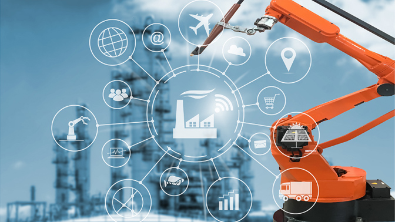

# Inteligencia Artificial Aplicada a la Industria

sector industrial en estos tiempos afronta un enorme desafío para ganar competitividad en plena transformación digital, en un mercado donde los nuevos hábitos de consumo nos obligan a reinventar una nueva forma de fabricar y visibilizar nuestros productos.

Estamos abocados a una nueva relación con los clientes donde se prime la personalización y la poca estandarización del producto, dirigido a clientes cada vez más interesados en acortar los plazos obligándonos a ser más ágiles y más rápidos.

Conseguir todo esto sin aumentar los costes, manteniendo la calidad y mejorando el servicio, sólo será posible implementando el Aprendizaje automático de las máquinas, o bien en lenguaje anglosajón el *Machine learning*.

Todo esto bajo el contexto de **la Industria 4.0**, abriendo un gran abanico de oportunidades en la cadena de producción, incrementando la productividad, reduciendo costes, ganando eficiencia a partir del análisis de los datos y optimizando la cadena de producción en tiempo real con la ayuda de algoritmos específicos para ello.

A continuación, veamos con detenimiento las ventajas que ofrece el **Machine Learning** aplicado a la fabricación avanzada:

## Análisis de los datos.

Partimos de que la digitalización debe ser general en todos los ámbitos, es decir, debe extenderse a todos los departamentos y convertirse en una estrategia básica para el cometido que estamos buscando.

Esto pasa por hacer un esfuerzo previo importante para la extracción de la información, como por ejemplo sensorizar e ingerir todo el enorme volumen de datos que producimos. Solo con esto, seremos capaces de integrarlos en todas las áreas ofreciendo una visualización de conjunto, pudiendo de esta manera destacar las relaciones y tendencias que nos permitan tomar mejores decisiones. Con ello, el proceso productivo en sí es capaz de aprender y ofrecer una toma de decisiones en tiempo real bajo contextos o escenarios diferentes de producción.

Algunos ejemplos sobre este nuevo paradigma podrían ser:

- Conociendo el estado de las máquinas, el sistema podría ser capaz de redistribuir la fabricación para evitar pérdidas y aumentar el rendimiento en la cadena de producción.

- Comprobar el stock y/o capacidad de almacén para evitar carencia en el suministro y satisfacer las necesidades de producto en de los pedidos.

- Con el estudio de las series temporales en la sensorización de las máquinas y _mergeando_ los eventos de fallos y/o comportamientos anómalos, podríamos anticiparnos a situaciones que puedan comprometer al proceso productivo.

## Análisis Predictivo.

Una buena recopilación de los datos como secuencias de tiempo y etiquetado correcto de los eventos generados en la cadena de producción permite al sistema anticiparse a eventos o estados y circunstancias nuevas para el sistema.

A nivel de producción, permite anticiparse a predecir nuevos pedidos de clientes habituales o identificar nuevos patrones de consumo en un nicho de mercado. Esto nos proporciona una fuerte capacidad de adaptación a la carga de trabajo de las máquinas pudiendo hacer frente al incremento del volumen de pedidos consiguiendo un notable incremento en las ventas. A otros niveles, como el de inventario, nos ayuda a gestionar de manera más óptima el stock, con el objetivo principal de prevenir un posible desabastecimiento.

Esta capacidad de predicción y anticipación a nuevos eventos es extrapolable a otros procesos como los de mantenimiento, de manera que el sistema es capaz de detectar averías antes de que estas ocurran, evitando paros productivos y posibles fallos en la calidad del producto.

## Automatización Inteligente.

Como se ha destacado anteriormente, este nuevo paradigma posibilita al sistema productivo a ser capaz de predecir y anticiparse, pero también a partir de todo el análisis de datos, el sistema confecciona nuevas estrategias para cumplir su cometido y obtener la mayor recompensa. Es decir, el sistema aprende y posibilita la mejora continua del proceso a partir de relaciones ocultas entre los datos, con el objetivo de maximizar sus recompensas a medida que la política de toma de decisiones o acciones se optimiza cada vez más en base a la _experiencia_. Con el término experiencia se está refiriendo al feedback de los estados y objetos monitorizados, por ello se dice que el sistema aprende.

Con ello, las máquinas van aprendiendo a partir de las incidencias y estados concretos del mundo real, como podría ser: paradas imprevistas, pedidos urgentes, falta de personal, cuellos de botella, beneficios varios, etc. A partir de este feedback de los estados reales del sistema, el proceso productivo automatiza las acciones más óptimas dado el proceso de aprendizaje acometido y que le permite tomar la política de acciones óptima para mantener el proceso productivo en las consignas de valores de rendimiento esperados.

Con todo lo comentado se puede llegar a la conclusión de que, con un sistema de estas características y fortalezas, ya no es necesaria la presencia de un operario en la planta, pudiendo éste dedicarse a otras actividades de creación de valor.

Con creación de valor se hace referencia a poder potenciar otras dotes del ser humano, como la de seguir enseñando a las máquinas a identificar patrones de no-calidad o patrones subjetivos de prevención, reduciendo así las incidencias y los picos de ineficiencia en el trabajo del operario, pudiendo las personas poner el foco en otras áreas de más valor añadido.

## Análisis de disposición.

Con esta herramienta se es capaz de visualizar y realizar predicciones en base a la capacidad del sistema para hacer frente a la demanda productiva. En este sentido, si el sistema determina que el proceso productivo no va a ser capaces de asumir una determinada carga de trabajo en los plazos establecidos, evalúa los posibles retrasos en otros pedidos y automatiza posibles alternativas siempre y cuando sea posible.

De igual manera, al tener toda la información en tiempo real, el sistema puede ser capaz de recomendar precios teniendo en cuenta los gastos productivos y la demanda. De tal manera que el sistema podría prescribir tarifas adecuándose a los márgenes.

## Personalización

Con este novedoso sistema podemos pasar la personalización del producto a primer plano y dejar en segundo plano la fabricación en masa. Con ello, se priman los pedidos a la carta, de los cuales con la Inteligencia Artificial ya no hará falta que una persona esté pendiente de la customización.

Esta personalización será posible hacerse con la máxima precisión y producción rápida, atendiendo a un nuevo modelo de negocio para la indústria donde se personifica el producto en base a diferentes perfiles de demanda, escalando a otro nivel más allá de la fabricación y venta del producto.

Esto se resume en la posibilidad de ofrecer servicios basados en el producto, potenciando la personalización del mismo.

---

Apostemos, pues, por estas herramientas disruptivas, no sólo para no perder competitividad, sino también para situarnos como empresas de referencia en la digitalización.

---

Si quieres conocer más acerca de mi, visita:

https://www.jaimesendraberenguer.com/
